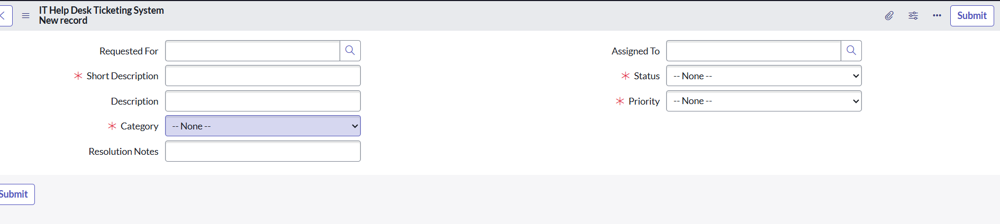
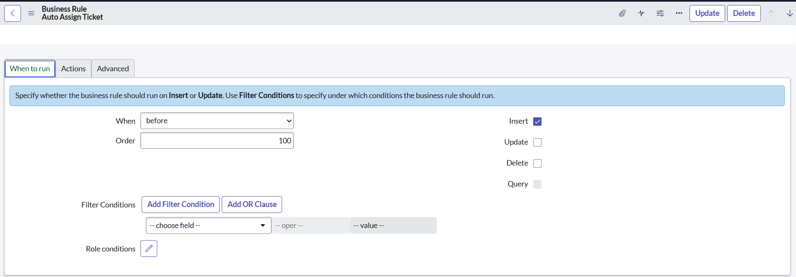
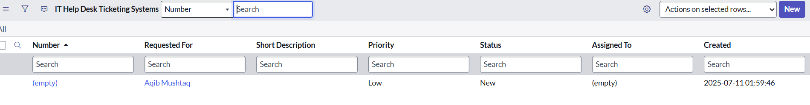

# IT Ticketing System – ServiceNow

This mini project simulates a basic IT Service Desk Ticketing System using the ServiceNow platform. Designed to show ServiceNow Admin-level configuration skills.

---

## ✅ Features Implemented

- Custom table: `IT Help Desk Ticketing System`
- Fields: Short Description, Category, Priority, Assigned To, Status, Comments
- Business Rule: Auto-assign ticket if category = Hardware
- Notification: On assignment and closure

---

## 🧑‍💻 Admin Work Done

| Feature            | Tool Used         |
|--------------------|-------------------|
| Table Creation     | Table Module       |
| Form Design        | Form Designer      |
| Automation         | Business Rules     |
| Dashboard          | List & Filter View |
| Email Trigger      | Notifications      |

---

## 📸 Screenshots

| Form Layout | Business Rule | Sample Ticket |
|-------------|----------------|----------------|
|  |  |  |

---

## 🛠 Tools Used
- ServiceNow Personal Developer Instance (PDI)

---

## 📄 Author

**Pragnasri** – ServiceNow Admin Fresher  
📧 saipragnachowdary@gmail.com  
🔗 GitHub: [@pragnasri123456](https://github.com/pragnasri123456)

